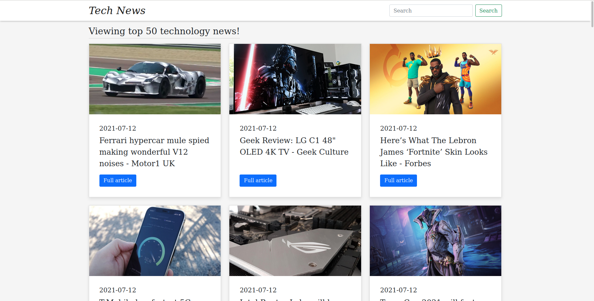

# tech-news

This is a server-side rendering web application that retrieves and displays the latest technology news with help from the API [newsapi](https://newsapi.org/).

The project is built using Node.JS, express, Bootstrap and EJS.

API: [newsapi](https://newsapi.org/)

<!-- GETTING STARTED -->
## ⚡️ Getting Started

### Prerequisites

Make sure to have the following installed:

* [Node.js](https://nodejs.org/en/) (version >= 14.15)

### Installation

1. Sign up and get a free API Key at [newsapi](https://newsapi.org/)

2. Clone the repo
  ```sh
  git clone https://github.com/lennca/tech-news.git
  ```

3. Install NPM packages
  ```sh
  npm install
  ```

4. Create a .env file in the root directory and add the following properties with values:

```
PORT=<PORT_TO_RUN_SERVER_ON>
API_KEY=<YOUR_API_KEY>
```

5. Start the application
  ```sh
  npm start
  ``` 

### Notes

Additional requirements or functionality is appreciated. Fork project or contact creator to contribute!

## Screenshots

<div>
  
</div>
<div>
  
</div>